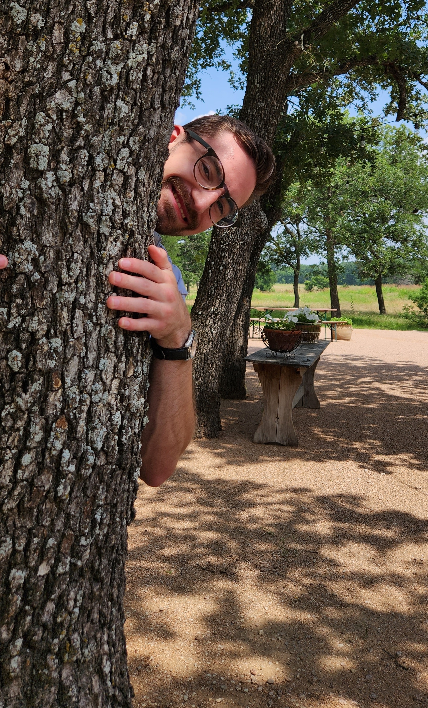

::: {layout="[40, 60]"}

## I'm Nathen Byford,
Nice to meat you! I'm a passionate statistician looking for opportunities to make the world a better 
and safer place using data science and statistical methods. 
My goals are to apply statistics to real world problems in the area of cyber security. 
**My areas of interest are:** computational statistics, machine learning, data processing, data visualization, anomaly detection and adversarial risk analysis.
:::

## Current Projects

### [Baylor Quarto Theme](https://github.com/nathenbyford/Baylor-quarto-theme)

Presentation theme for making reveal.js presentations. The theme includes Baylor University colors and other theme elements.

### [USGS Earthquake data](earthquake.qmd)

Using data from USGS Earthquake Catalog to build models of earthquake predictions. Locations and magnitude.

## Past Projects

### [Benford's Law](https://github.com/nathenbyford/Benfords-Law-Research)

### [MoWaTER](https://github.com/nathenbyford/MoWaTER)

