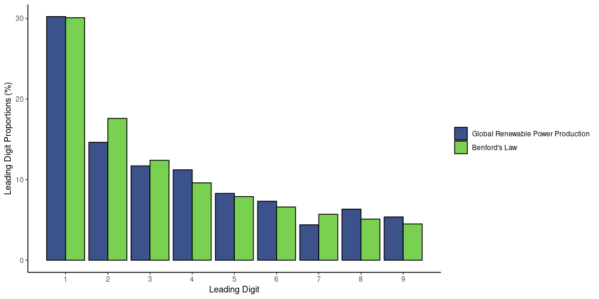
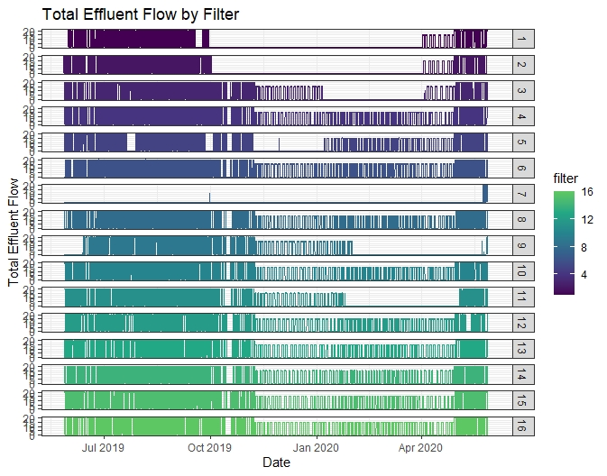

### [Data Driven Anomaly Detection](https://github.com/nathenbyford/anomaly-detection-project)
{width=70%}  
As a part of STA 5360 at Baylor university my final project was comparing different approaches to anomaly detection. These methods included a simple yet good linear model method, seasonal time series decomposition using loess (STL), isolation forests, and a neural network.

### [Benford's Law](https://github.com/nathenbyford/Benfords-Law-Research)
{width=70%}  
Analysis of statistical tests that can be used to test for Benford's Law. As a part of RUSIS @ OSU 2021.

### [MoWaTER](https://github.com/nathenbyford/MoWaTER)
{width=70%}  
Analysis of Water filter efficiency and cleanliness at Denver water's foothill water treatment plant. As a part of MoWaTER summer research group @ Baylor Univesity 2020.