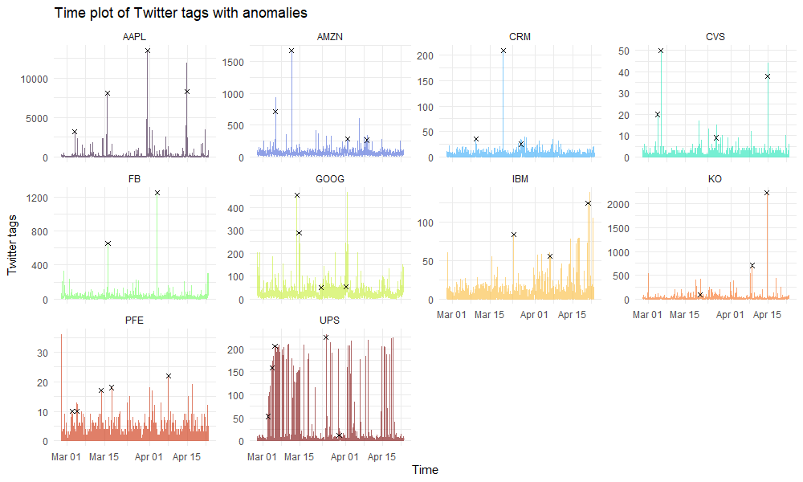

### [Anomaly Detection](https://github.com/nathenbyford/anomaly-detection-project)
{width=80%}  
Machine learining project comparing different methods for identifying anomalies in time series data. Completed as final project for advanced data driven methods course (STA 5360) at Baylor University.

### [Benford's Law](https://github.com/nathenbyford/Benfords-Law-Research)
{width=80%}  
Analysis of statistical tests that can be used to test for Benford's Law and a look into Benford's Law for words. As a part of RUSIS @ OSU 2021.

### [MoWaTER](https://github.com/nathenbyford/MoWaTER)
Analysis of Water filter efficiency and cleanliness at Denver water's foothill water treatment plant. As a part of MoWaTER summer research group @ Baylor Univesity 2020.